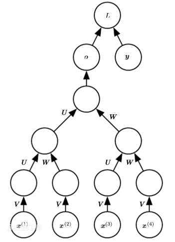
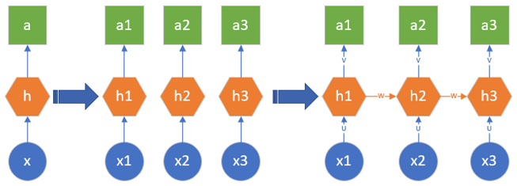
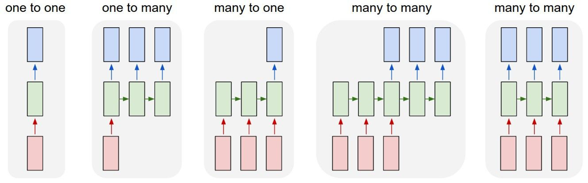
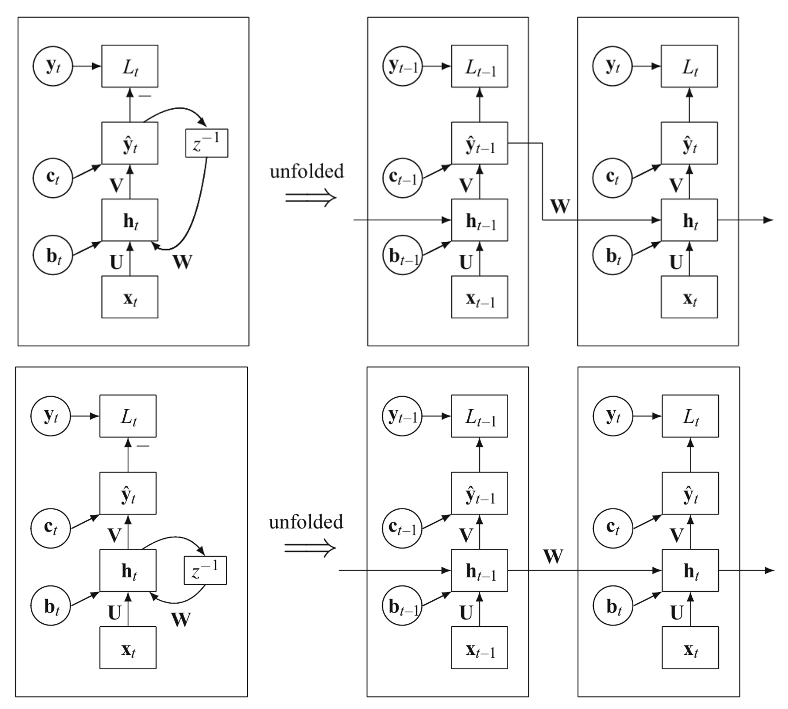
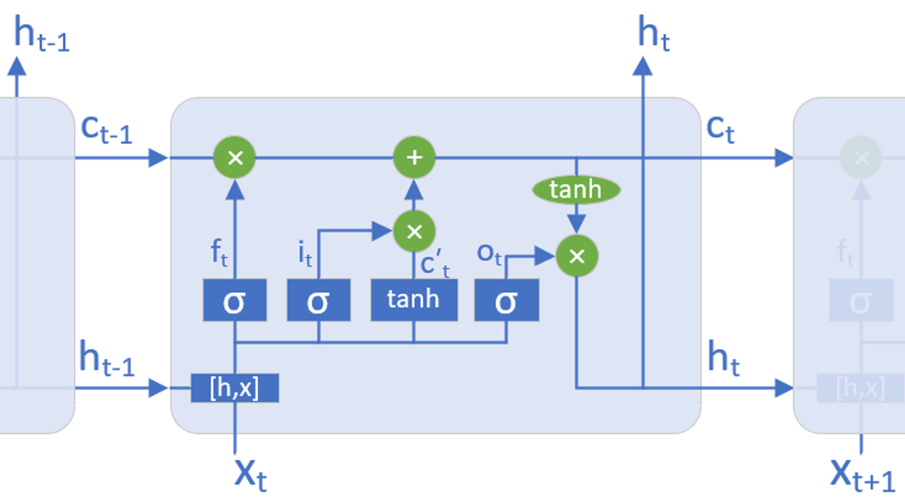

# Recurrent Neural Network

## Introduction of RNN

### Definition

Recurrent neural networks (RNNs) are a class of artificial neural network commonly **used for sequential data processing**. Unlike feedforward neural networks, which process data in a single pass, RNNs process data across multiple time steps, making them well-adapted for modelling and processing text, speech, and time series.

循环神经网络（Recurrent Neural Network），简称RNN，是一种专门用于**处理序列数据**的神经网络模型。与传统的前馈神经网络不同，RNN在层与层之间的节点是有连接的，这使得它能够在当前的输出中利用之前的信息。RNN的这种设计使其在处理如自然语言文本或时间序列数据等序列化信息时表现出色。

> A recurrent neural network (RNN), proposed by Rumelhartin et al. in 1986, is a **neural network model for modeling time series.** RNNs provide a very powerful way of dealing with **(time) sequential data**. In traditional neural network models, it is operated from the input layer to hidden layer to output layer. These layers are fully connected, and there is no connection between nodes of each layer. For tasks that involve sequential inputs, such as speech and language, it is often better to use RNNs.

### What is "Recurrent"?

The modern definition of "recurrent" was initially introduced by Jordan (1986):

> If a network has one or more cycles, that is, **if it is possible to follow a path from a unit back to itself**, then the network is referred to as recurrent. A nonrecurrent network has no cycles.
>
> 如果一个网络有一个或者多个循环，也就是说，如果沿着一条路径，可以从一个单元返回到它自己，那么该网络称为 Recurrent。

### Why Do We Need It?
- 在前馈神经网络中，信息的传递是单向的，这种限制虽然使得网络变得更容易学习，但在一定程度上也减弱了神经网络模型的能力。在生物神经网络中，神经元之间的连接关系要复杂得多。前馈神经网络可以看作一个复杂的函数，每次输入都是独立的，即网络的输出只依赖于当前的输入。
- 在自然界中，还有很多随着时间而变化的数据需要处理，比如，对一个人来说，在不同的年龄会有不同的身高、体重、健康状况，只有性别是固定的。如果需要根据年龄来预测此人的健康状况，则需要每年对此人的情况进行一次采样，按时间排序后记录到数据库中。
- 此外，前馈网络难以处理时序数据，比如视频、语音、文本等。时序数据的长度一般是不固定的，而前馈神经网络要求输入和输出的维数都是固定的，不能任意改变。因此，当处理这一类和时序数据相关的问题时，就需要一种能力更强的模型。

### What Is the Difference?

- 循环神经网络 (Recurrent Neural Network) ，(Rumelhart et al., 1986c) 通常被称为RNN，是一类用于处理序列数据的链式神经网络。

- 递归神经网络(Recursive Neural Network)，(Pollack,1990) 是具有树状阶层结构且网络节点按其连接顺序对输入信息进行处理的人工神经网络。

> **Model Comparison:**
>
> - Recurrent Neural Networks: Most **cognitively** plausible (reading from left to right), not usually the highest classification performance but lots of improvements right now with gates (GRUs, LSTMs, etc).
> - Recursive Neural Networks: most **linguistically** plausible, interpretable provide most important phrases, need parse trees.
>
> 模型比较：
>
> - 循环神经网络：在**认知**上最可信（从左到右阅读），分类性能通常不是最高的，但现在通过门（GRUs、LSTMs 等）有了很多改进。
> - 递归神经网络：**语言**上最可信，可解释，提供最重要的短语，需要解析树。

> **RecNNs generalize RNNs. (Akbar Karimi)**:
>
> - **RecNNs generalize RNNs.** Because of their tree structure, they can learn hierarchical models as opposed to RNNs that can handle only sequential data. The number of children for each node in the tree is fixed so that it can perform recursive operations and use the same weights across the steps.
>
> - **RecNN 泛化了 RNN。** 由于它们的树结构，它们可以学习分层模型，而不是只能处理顺序数据的 RNN。树中每个节点的子节点数是固定的，因此它可以执行递归操作并在步骤中使用相同的权重。

### Brief History of RNNs

1. **1933: 反响回路假设**  
    西班牙神经生物学家 Rafael Lorente de Nó 发现大脑皮层的解剖结构允许刺激在神经回路中循环传递，并由此提出反响回路假设（*reverberating circuit hypothesis*）。

2. **1982: Hopfield神经网络**  
    美国学者 John Hopfield 使用二元节点建立了具有结合存储（*content-addressable memory*）能力的神经网络，即 Hopfield 神经网络。

3. **1986: Jordan网络**  
    Michael I. Jordan 基于 Hopfield 网络的结合存储概念，在分布式并行处理理论下建立了新的循环神经网络，即 Jordan 网络。

4. **1990: Elman网络**  
    Jeffrey Elman 提出了第一个全连接的循环神经网络，即 Elman 网络。Jordan 网络和 Elman 网络是最早出现的面向序列数据的循环神经网络，由于二者都从单层前馈神经网络出发建立递归连接，因此也被称为简单循环网络（*Simple Recurrent Network, SRN*）。

5. **1991: 随时间反向传播**  
    1990年，Paul Werbos提出了循环神经网络的随时间反向传播（BP Through Time，BPTT），BPTT被沿用至今，是循环神经网络进行学习的主要方法。

6. **1991: 长程依赖问题**  
    1991年，Sepp Hochreiter发现了循环神经网络的长期依赖问题（*long-term dependencies problem*）。

7. **1991+: 优化与改进**  
    此后，大量优化理论得到引入并衍生出许多改进算法，包括神经历史压缩器（*Neural History Compressor, NHC*）、长短期记忆网络（*Long Short-Term Memory networks, LSTM*）、门控循环单元网络（*Gated Recurrent Unit networks, GRU*）、回声状态网络（*echo state network*）、独立循环神经网络（*Independent RNN*）等。

### From Feed-Forward NNs to RNNs

- 根据一个静态的输入数据$x$，经过隐层$h$的计算，最终得到结果$a$。这里的$h$是全连接神经网络或者卷积神经网络，$a$是回归或分类的结果。
- 当遇到序列数据的问题后（假设时间步数为3），可以建立三个前馈神经网络来分别处理$t=1,2,3$的数据，即$x1,x2,x3$。
- 但是两个时间步之间是有联系的，于是在隐层$h1,h2,h3$之间建立了一条连接线，实际上是一个矩阵$\boldsymbol{W}$。
- 根据序列数据的特性，可以扩充时间步的数量，在每个相邻的时间步之间都会有联系。

> - $\boldsymbol{U}$: 输入层到隐藏层的权重矩阵。（输入-隐层矩阵）
> - $\boldsymbol{V}$: 隐藏层到输出层的权重矩阵。（隐层-输出矩阵）
> - $\boldsymbol{W}$: 隐藏层上一次的值作为这一次的输入的权重矩阵。（输出-隐层矩阵）
>

### Architecture of RNNs

1. Vanilla neural networks (One-to-One).
2. One-to-Many.
3. Many-to-One.
4. Many-to-Many, Version 1.
5. Many-to-Many, Version 2.

## Simple Recurrent Network

### Elman and Jordan Network

简单循环网络(Simple Recurrent Network, SRN)是一个非常简单的循环神经网络，只有一个隐藏层。在一个两层的前馈神经网络中，连接存在相邻的层与层之间，隐藏层的节点之间是无连接的。而简单循环网络增加了从隐藏层到隐藏层的反馈连接。

简单循环神经网络在时刻 $t$ 的更新公式为（具有隐藏状态反馈）：
$$
\begin{cases}
 \boldsymbol{s}_t=f(\boldsymbol{U}\boldsymbol{x}_t+\boldsymbol{W}\boldsymbol{s}_{t-1}+\boldsymbol{b}_t)\\
    \hat{\boldsymbol{y}}_t=\text{Output}(\boldsymbol{V}\boldsymbol{s}_t+\boldsymbol{c}_t)\\
    L_t(\boldsymbol{y}_t,\hat{\boldsymbol{y}}_t)=\text{Loss}(\boldsymbol{y}_t,\hat{\boldsymbol{y}}_t)
\end{cases}
$$
代表：Elman网络。

简单循环神经网络在时刻 $t$ 的更新公式为（具有输出状态反馈）：
$$
\begin{cases}
\boldsymbol{s}_t=f(\boldsymbol{U}\boldsymbol{x}_t+\boldsymbol{W}\hat{\boldsymbol{y}}_{t-1}+\boldsymbol{b}_t)\\
\hat{\boldsymbol{y}}_t=\text{Output}(\boldsymbol{V}\boldsymbol{s}_t+\boldsymbol{c}_t)\\
L_t(\boldsymbol{y}_t,\hat{\boldsymbol{y}}_t)=\text{Loss}(\boldsymbol{y}_t,\hat{\boldsymbol{y}}_t)
\end{cases}
$$
代表：Jordan网络。

> 区别：
>
> 1. Elman Network的一个recurrent层的输出经过时延后作为下一时刻这一层的输入的一部分，然后recurrent层的输出同时送到网络后续的层，比如最终的输入层。
> 2. Jordan network则直接把整个网络最终的输出（i.e. 输出层的输出）经过时延后反馈回网络的输入层。

### Why is it "General"?

#### Universal Approximation Theorem

设 $\phi(\cdot)$ 是一个非常数、有界、单调递增且连续函数（激活函数），$x$ 是一个 $D$ 维实数向量，满足 $x \in [0,1]^D$。记 $C(x)$ 为定义在 $x$ 上的连续函数集合，即输入为长度为 $D$ 的向量，且每个维度的值都在区间 $[0,1]$ 内的实数。

**对于任意给定的函数 $f \in C(x)$，存在一个正整数 $M$，以及一组实数 $u_m, b_m \in \mathbb{R}$ 和实数向量 $w_m \in \mathbb{R}^D$，使得通过如下形式的函数**  
$$
	F(x) = \sum_{m=1}^{M} u_m \phi\left(w_m^{T} x + b_m\right)
$$
**可以近似实现 $f(x)$，即满足 $|F(x) - f(x)| < \epsilon, \quad \forall x \in [0,1]^D$，**
**其中 $\epsilon > 0$ 是一个任意小的正数。**

通用近似定理在 $D$ 维实数空间 $\mathbb{R}^D$ 中的有界闭集上依然成立。

循环神经网络的拟合能力也十分强大。一个完全连接的循环网络是任何非线性动力系统的近似器。

**如果一个完全连接的循环神经网络有足够数量的 sigmoid 型隐藏神经元，它可以以任意的准确率去近似任何一个非线性动力系统**
$$
\begin{aligned}
		\boldsymbol{s}_t&=g(\boldsymbol{s}_{t-1},\boldsymbol{x}_t)\\
		\boldsymbol{y}_t&=o(\boldsymbol{s}_t),
	\end{aligned}
$$
**其中，$s_t$ 为隐藏状态，$x_t$ 为外部输入，$g(\cdot)$ 为可测得的状态转移函数，$o(\cdot)$ 为连续输出函数。**

根据通用近似定理，两层的前馈神经网络可以近似任意有界闭集上的任意连续函数。因此，动力系统的两个函数可以用两层的全连接前馈网络近似。

#### Turing Completeness

**所有的图灵机都可以被一个由使用 Sigmoid 型激活函数的神经元构成的全连接循环网络来进行模拟。**

因此，一个完全连接的循环网络是可以近似解决所有的可计算问题。

### Gradient Descent

给定一个训练样本$(\boldsymbol{x},\boldsymbol{y})$，其中$\boldsymbol{x}_{1:T}=(\boldsymbol{x}_1,\boldsymbol{x}_2,\cdots,\boldsymbol{x}_T)$是输入序列，$\boldsymbol{y}_{1:T}=(\boldsymbol{y}_1,\boldsymbol{y}_2,\cdots,\boldsymbol{y}_T)$是输出序列。对于每一个时间步$t$，损失函数为$L_t=\text{Loss}(\boldsymbol{y}_t,\hat{\boldsymbol{y}}_t)$，其中$\hat{\boldsymbol{y}}_t$是网络在时间步$t$的输出，$\text{Loss}$是可微的损失函数，如均方误差或交叉熵。则这个序列的总损失函数为
$$
    L=\sum_{t=1}^{T}L_t.
$$
整个序列的损失函数$L$关于网络参数$\boldsymbol{U,V,W}$的梯度为每个时刻的损失函数$L_t$关于参数$\boldsymbol{U,V,W}$的偏导数之和，即
$$
    \frac{\partial L}{\partial \boldsymbol{U}}=\sum_{t=1}^{T}\frac{\partial L_t}{\partial \boldsymbol{U}},\quad \frac{\partial L}{\partial \boldsymbol{V}}=\sum_{t=1}^{T}\frac{\partial L_t}{\partial \boldsymbol{V}},\quad \frac{\partial L}{\partial \boldsymbol{W}}=\sum_{t=1}^{T}\frac{\partial L_t}{\partial \boldsymbol{W}}.
$$

由于$f(\cdot)$是递归调用的，因此在计算梯度时，需要新的方法。

1. 反向传播通过时间（BackPropagation Through Time, BPTT）
2. 实时循环学习（Real-Time Recurrent Learning, RTRL）。

- BPTT的主要思想是将网络展开为一个前馈神经网络，然后使用标准的反向传播算法来计算梯度。展开的长度取决于序列的长度，因此BPTT的计算复杂度随着序列长度的增加而增加。在展开的前馈网络中，所有层的参数是共享的，因此在计算梯度时，需要将所有时刻的梯度相加。
- 与BP算法不同的是，权重矩阵W和U的寻优过程需要追溯之前的历史数据。

BPTT算法是针对循环层的训练算法，它的基本原理和BP算法是一样的，也包含同样的三个步骤:

1. 前向计算每个神经元的输出值；
2. 反向计算每个神经元的误差项$\delta_j$，即误差函数对神经元$j$的加权输入$\text{net}_j$的偏导数。
3. 计算每一个权重的梯度。

### BackPropagation Through Time (BPTT)
1. 前向计算：
    $$
    \boldsymbol{s}_t=f(\boldsymbol{Ux}_t+\boldsymbol{Ws}_{t-1})
    $$

2. 误差项的计算：
   
   记第$l$层$t$时刻的误差项为$\delta_t^l$。则其沿两个方向传播：

    - 沿时间线传递到初始时刻，得到$\delta_1^{l}$，这部分只和权重矩阵$\boldsymbol{W}$有关。
    - 传递到上一层网络，得到$\delta_t^{l-1}$，这部分只和权重矩阵$\boldsymbol{U}$有关。
   
    令$\text{net}_t$表示神经元在t时刻的加权输入（净输入），即：$\text{net}_t=\boldsymbol{Ux}_t+\boldsymbol{Ws}_{t-1}$.
    考虑
   $$
    \frac{\partial\text{net}_{t}}{\partial\text{net}_{t-1}}=\frac{\partial \text{net}_{t}}{\partial \boldsymbol{s}_{t-1}}\cdot\frac{\partial \boldsymbol{s}_{t-1}}{\partial \text{net}_{t-1}}
   $$
    等号右边是向量对向量求导，有
   $$
    \frac{\partial \text{net}_{t}}{\partial \boldsymbol{s}_{t-1}}=\boldsymbol{W}, \frac{\partial \boldsymbol{s}_{t-1}}{\partial \text{net}_{t-1}}=\textbf{Diag}(f'(\text{net}_{t-1}))
   $$
    由于$\frac{\partial \text{net}_{t},i}{\partial \boldsymbol{s}_{t-1},j}=w_{ji},$和$\frac{\partial \boldsymbol{s}_{t-1},k}{\partial \text{net}_{t-1},k}=f'(\text{net}_{t-1,k})$。

    误差项沿时间反向传播的计算公式为：
   $$
    \delta^L_k=\delta^L_t\prod_{i=k}^{t-1}\boldsymbol{W}\textbf{Diag}[f'(\text{net}_i)]
   $$

    循环层将误差项反向传递到上一层网络，与普通的全连接层完全一样。
   $$
    \begin{aligned}
        \operatorname{net}_{t}^{l} & = \boldsymbol{U} \boldsymbol{a}_{t}^{l-1} + \boldsymbol{W} \boldsymbol{s}_{t-1} \\
        \boldsymbol{a}_{t}^{l-1} & = f^{l-1}\left(\operatorname{net}_{t}^{l-1}\right)
    \end{aligned}
   $$
    类似地，有：
   $$
    (\delta_t^{l-1})^T=(\delta_t^l)^T\boldsymbol{U}\textbf{Diag}[f'^{l-1}(\text{net}_t^{l-1})]
   $$

3. 计算梯度（标量对矩阵求导）：
    因为
    $$
    \frac{\partial L}{\partial w_{ji}}= \frac{\partial L}{\partial \text{net}_{t,j}}\frac{\partial \text{net}_{t,j}}{\partial w_{ji}}
    $$
    所以
    $$
    \nabla_{W_t} L =
    \begin{bmatrix}
        \delta_1^t s_1^{t-1} & \delta_1^t s_2^{t-1} & \cdots & \delta_1^t s_n^{t-1} \\
        \delta_2^t s_1^{t-1} & \delta_2^t s_2^{t-1} & \cdots & \delta_2^t s_n^{t-1} \\
        \vdots & \vdots & \ddots & \vdots \\
        \delta_n^t s_1^{t-1} & \delta_n^t s_2^{t-1} & \cdots & \delta_n^t s_n^{t-1}
    \end{bmatrix}
    $$
    最终的梯度是各个时刻的梯度之和：
    $$
    \nabla_{W} L = \sum_{t=1}^{T} \nabla_{W_t} L
    $$
    矩阵$\boldsymbol{U}$同理。

4. 对于矩阵$\boldsymbol{V}$，只需关注目前的状态。另外，RNN的损失也是会随着时间累加的，所以不能只求t时刻的偏导。
$$
\frac{\partial L}{\partial \boldsymbol{V}}=\sum_{t=1}^{T}\frac{\partial L_t}{\partial \text{output}_t}\frac{\partial \text{output}_t}{\partial \boldsymbol{V}}
$$
## Long Term Dependencies

### Gradient Exploding and Vanishing

误差项沿时间反向传播的计算公式为：
$$
\delta^L_k=\delta^L_t\prod_{i=k}^{t-1}\boldsymbol{W}\textbf{Diag}[f'(\text{net}_i)]
$$
注意，由于使用链式求导法则，式中有一个连乘项, 如果激活函数是挤压型，例如 $\tanh$ 或 Sigmoid , 他们的导数值在 [0,1] 之间。我们再来看$W$。
1. 如果$W$的值在 (0,1) 的范围内， 则随着$t$的增大，连乘项会越来越趋近于0， 误差无法传播，这就导致了**梯度消失**的问题。
2. 如果$W$的值很大，使得$\boldsymbol{W}\textbf{Diag}[f'(\text{net}_i)]$的值大于$1$， 则随着$t$的增大，连乘项的值会呈指数增长，并趋向于无穷，产生**梯度爆炸**。

梯度消失使得误差无法传递到较早的时刻，权重无法更新，网络停止学习。梯度爆炸又会使网络不稳定，梯度过大，权重变化太大，无法很好学习，最坏情况还会产生溢出（NaN）错误而无法更新权重。

- 采用半线性激活函数ReLU代替挤压型激活函数，ReLU函数在定义域大于0的部分，导数恒等于1，来解决梯度消失问题。
- 合理初始化权重$W$，使$\boldsymbol{W}\textbf{Diag}[f'(\text{net}_i)]$的值尽量趋近于1，避免梯度消失和梯度爆炸。

上面两种办法都有一定的缺陷，ReLU函数有自身的缺点，而初始化权重的策略也抵不过连乘操作带来的指数增长问题。要想根本解决问题，必须去掉连乘项。

## Long Short-Term Memory and Gated Recurrent Unit
### LSTM
长短时记忆网络（LSTM）设计思路比较简单，原来的RNN中隐藏层只有一个状态`h`，对短期输入敏感，现在再增加一个状态`C`，来保存长期状态。这个新增状态称为细胞状态（cell state）或单元状态。

如何控制长期状态`C`？在任意时刻$t$，我们需要确定三件事：

1. $t-1$时刻传入的状态$c_{t-1}$，有多少需要保留。
2. 当前时刻的输入信息，有多少需要传递到$t+1$时刻。
3. 当前时刻的隐层输出$h_t$是什么。

LSTM设计了门控(gate)结构，控制信息的保留和丢弃。LSTM有三个门，分别是：遗忘门（forget gate），输入门（input gate）和输出门（output gate）。

#### Forget Gate

遗忘门的输出为$f_t$， 采用sigmoid激活函数，将输出映射到[0,1]区间。上一时刻细胞状态$c_{t-1}$通过遗忘门时，与$f_t$结果相乘，这样就决定了上一细胞状态$c_{t-1}$有多少能进入当前状态$c_t$。

遗忘门$f_t$的公式如下：
$$
f_t = \sigma(h_{t-1} \cdot W_f + x_t \cdot U_f + b_f)
$$
其中，$\sigma$为sigmoid激活函数，$h_{t-1}$ 为上一时刻的隐层状态，形状为$(1 \times h)$的行向量。$x_t$为当前时刻的输入，形状为$(1 \times i)$的行向量。参数矩阵$W_f$、$U_f$分别是$(h \times h)$和$(i \times h)$的矩阵，$b_f$为$(1 \times h)$的行向量。

#### Input Gate
输入门$i_t$决定输入信息有哪些被保留，输入信息包含当前时刻输入和上一时刻隐层输出两部分，存入即时细胞状态$\tilde{c}_t$中。输入门依然采用sigmoid激活函数，将输出映射到[0,1]区间。$\tilde{c}_t$通过输入门时进行信息过滤。

输入门$i_t$的公式如下：
$$
i_t = \sigma(h_{t-1} \cdot W_i + x_t \cdot U_i + b_i)
$$
即时细胞状态 $\tilde{c}_ t$的公式如下:
$$
\tilde c_t = \tanh(h_{t-1} \cdot W_c + x_t \cdot U_c + b_c)
$$

上一时刻保留的信息，加上当前输入保留的信息，构成了当前时刻的细胞状态$c_t$。

当前细胞状态$c_t$的公式如下：
$$
c_t = f_t \circ c_{t-1}+i_t \circ \tilde{c}_t 
$$
$\circ$ 表示 Hadamard 乘积。

> $\tilde c_t = \tanh(h_{t-1} \cdot W_c + x_t \cdot U_c + b_c)$：Sigmoid函数的输出是一个压缩到[0, 1]区间的值，适合用来表示门控机制的概率，即某个信息是否被“允许通过”或“被遗忘”。而$\tilde c_t$为当前时间步的候选记忆，它需要包含“增加”或“减少”的信息（正负值）。
>
> $i_t,\ \tilde c_t$：控制信息流动的灵活性和有效性。一个负责控制候选信息的加入比例，另一个负责生成新的候选记忆，表达当前时刻的输入和过去信息如何影响细胞状态。如果没有$i_t$，候选状态的信息无法被选择性地过滤，所有的输入都可能直接影响细胞状态。

#### Output Gate

最后，需要确定输出信息。输出门$o_t$决定 $h_{t-1}$ 和 $x_t$ 中哪些信息将被输出，公式如下：

$$
o_t = \sigma(h_{t-1} \cdot W_o + x_t \cdot U_o + b_o) 
$$

细胞状态$c_t$通过tanh激活函数压缩到 (-1, 1) 区间，通过输出门，得到当前时刻的隐藏状态$h_t$作为输出，公式如下：

$$
h_t=o_t \circ \tanh(c_t)
$$

最后，时刻t的预测输出为：

$$
a_t = \sigma(h_t \cdot V + b)
$$

其中，

$$
z_t = h_t \cdot V + b
$$

经过上面的步骤，LSTM就完成了当前时刻的前向计算工作。

### GRU

门控循环单元（Gated Recurrent Unit，GRU）网络是一种比LSTM网络更加简单的循环神经网络。

它对LSTM做了一些简化：

1. GRU将LSTM原来的三个门简化成为两个：重置门 $r_t$（Reset Gate）和更新门 $z_t$ (Update Gate)。
    - 在LSTM网络中，输入门和遗忘门是互补关系，具有一定的冗余性。GRU网络直接使用一个门（更新门）来控制输入和遗忘之间的平衡。
    - 更新门来控制当前状态需要从历史状态中保留多少信息（不经过非线性变换），以及需要从候选状态中接受多少新信息。
    - 重置门用来控制候选状态$\tilde h_t$的计算是否依赖上一时刻的状态$h_{t-1}$。
2. GRU不保留单元状态 $c_t$，只保留隐藏状态 $h_t$作为单元输出，这样就和传统RNN的结构保持一致。

更新门
$$
z_t = \sigma(h_{t-1} \cdot W_z + x_t \cdot U_z)
$$

重置门
$$
r_t = \sigma(h_{t-1} \cdot W_r + x_t \cdot U_r)
$$

候选隐藏状态
$$
\tilde{h}_t = \tanh((r_t \circ h_{t-1}) \cdot W_h + x_t \cdot U_h)
$$

隐藏状态
$$
h_t = (1 - z_t) \circ h_{t-1} + z_t \circ \tilde{h}_t
$$

GRU通过更新门和重置门控制长期状态的遗忘和保留，以及当前输入信息的选择。更新门和重置门通过Sigmoid函数，将输入信息映射到$[0,1]$区间，实现门控功能。

首先，上一时刻的状态$h_{t-1}$通过重置门，加上当前时刻输入信息，共同构成当前时刻的即时状态$\tilde{h}_t$，并通过$\tanh$函数映射到$[-1,1]$区间。

然后，通过更新门实现遗忘和记忆两个部分。从隐藏状态的公式可以看出，通过$z_t$进行选择性的遗忘和记忆。$(1-z_t)$和$z_t$有联动关系，上一时刻信息遗忘的越多，当前信息记住的就越多，实现了LSTM中$f_t$和$i_t$的功能。

## References

1. [CS231n Lecture 7](https://cs231n.stanford.edu/slides/2024/lecture_7.pdf)

2. K. Cho, B. van Merrienboer, C. Gulcehre, D. Bahdanau, F. Bougares, H. Schwenk, and Y. Bengio. Learning phrase representations using RNN encoder-decoder for statistical machine translation, 2014. [arXiv:1406.1078](https://arxiv.org/abs/1406.1078).

3. J. Chung, C. Gulcehre, K. Cho, and Y. Bengio. Empirical evaluation of gated recurrent neural networks on sequence modeling, 2014. [arXiv:1412.3555](https://arxiv.org/abs/1412.3555).

4. J. L. Elman. Finding structure in time. Cognitive Science, 14(2):179–211, 1990.

5. K. Hornik, M. Stinchcombe, and H. White. Multilayer feedforward networks are universal approximators. Neural Networks, 2(5):359–366, 1989. ISSN 0893-6080.

6. M. Jordan. Serial order: a parallel distributed processing approach. Advances in Psychological Science, 121:471–495, 1986.

7. H. T. Siegelmann and E. D. Sontag. Turing computability with neural nets. Applied Mathematics Letters, 4(6):77–80, 1991. ISSN 0893-9659.

8. 胡晓武，秦婷婷，李超，邹欣. 智能之门. 高等教育出版社, 北京, 2020. ISBN 9787040541410.

9. 邱锡鹏. 神经网络与深度学习. 机械工业出版社, 北京, 2020. ISBN 9787111649687.
