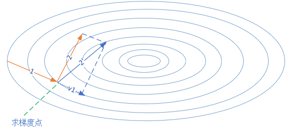
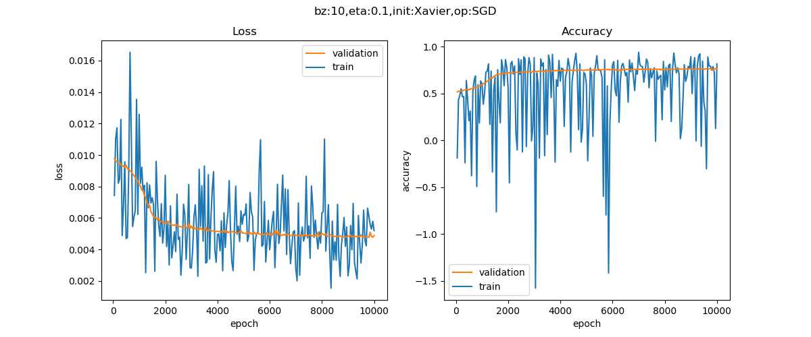
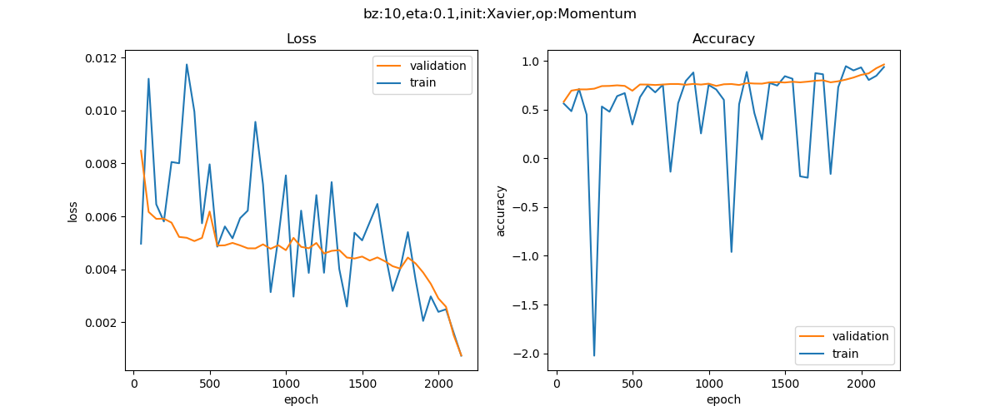
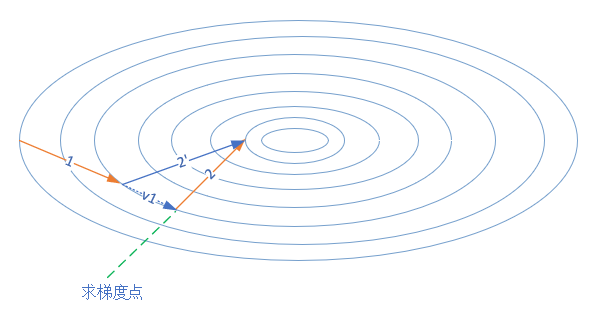

# Optimization of Gradient Descent

## 1 优化算法

### 1.1 随机梯度下降 SGD

1. **特征**：随机梯度下降算法，在当前点计算梯度，根据学习率前进到下一点。到中点附近时，由于样本误差或者学习率问题，会发生来回徘徊的现象，很可能会错过最优解。

2. **输入和参数**：$\eta$ - 全局学习率

3. **算法**：

	> 计算梯度：$g_t = \nabla_\theta J(\theta_{t-1})$
	>
	> 更新参数：$\theta_t = \theta_{t-1}  - \eta \cdot g_t$

4. **潜在的问题**：

	- SGD的一个缺点就是收敛速度慢。如，在学习率为`0.1`时，训练10000个`epoch`不能收敛到预定损失值；学习率为`0.3`时，训练5000个`epoch`可以收敛到预定水平。
	- SGD方法的另一个缺点是其更新方向完全依赖于当前batch计算出的梯度，因而十分不稳定，因为数据有噪音。

### 1.2 动量算法 Momentum

1. Momentum算法借用了物理中的动量概念，它模拟的是物体运动时的惯性，即更新的时候在一定程度上保留之前更新的方向，同时利用当前batch的梯度微调最终的更新方向。

  这样一来，可以在一定程度上增加稳定性，从而学习地更快，并且还有一定摆脱局部最优的能力。Momentum算法会观察历史梯度，若当前梯度的方向与历史梯度一致（表明当前样本不太可能为异常点），则会增强这个方向的梯度。若当前梯度与历史梯度方向不一致，则梯度会衰减。

  > 在图中，第一次的梯度更新完毕后，会记录$v_1$的动量值。在“求梯度点”进行第二次梯度检查时，得到2号方向，与$v_1$的动量组合后，最终的更新为2'方向。这样一来，由于有$v_1$的存在，会迫使梯度更新方向具备“惯性”，从而可以减小随机样本造成的震荡。

2. **输入和参数**：

  - $\eta$ - 全局学习率
  - $\alpha$ - 动量参数，一般取值为0.5, 0.9, 0.99
  - $v_t$ - 当前时刻的动量，初值为0

3. **算法**：

  > 计算梯度：$g_t = \nabla_\theta J(\theta_{t-1})$
  >
  > 更新动量：$v_t = \alpha v_{t-1} - \eta g_t$
  >
  > 更新参数：$\theta_t = \theta_{t-1} + v_t$

::: warning 等价公式

有时候还会看见这样的公式：

> 计算梯度：$g_t = \nabla_\theta J(\theta_{t-1})$
>
> 更新动量：$v_t = \alpha v_{t-1} + \eta g_t$
>
> 更新参数：$\theta_t = \theta_{t-1} - v_t$

但是，他们两个其实是等价的。根据原公式，有：

> 0. $v_0 = 0$
> 1. $dW_0 = \nabla J(w)$
> 2. $v_1 = \alpha v_0 - \eta \cdot dW_0 = -\eta \cdot dW_0$
> 3. $W_1 = W_0 + v_1=W_0 - \eta \cdot dW_0$
> 4. $dW_1 = \nabla J(w)$
> 5. $v_2 = \alpha v_1 - \eta dW_1$
> 6. $W_2 = W_1 + v_2 = W_1 + (\alpha v_1 - \eta dW_1) = W_1 - \alpha \cdot \eta \cdot dW_0 - \eta \cdot dW_1$
> 7. $dW_2 = \nabla J(w)$
> 8. $v_3=\alpha v_2 - \eta dW_2$
> 9. $W_3 = W_2 + v_3=W_2 + (\alpha v_2 - \eta dW_2) = W_2 - \alpha^2 \eta dW_0 - \alpha \eta dW_1-\eta dW_2$

根据等价公式，有

> 0. $v_0 = 0$
>
> 1. $dW_0 = \nabla J(w)$
> 2. $v_1 = \alpha v_0 + \eta \cdot dW_0 = \eta \cdot dW_0$
> 3. $W_1 = W_0 - v_1=W_0 - \eta \cdot dW_0$
> 4. $dW_1 = \nabla J(w)$
> 5. $v_2 = \alpha v_1 + \eta dW_1$
> 6. $W_2 = W_1 - v_2 = W_1 - (\alpha v_1 +\eta dW_1) = W_1 - \alpha \cdot \eta \cdot dW_0 - \eta \cdot dW_1$
> 7. $dW_2 = \nabla J(w)$
> 8. $v_3=\alpha v_2 + \eta dW_2$
> 9. $W_3 = W_2 - v_3=W_2-(\alpha v_2 + \eta dW_2) = W_2 - \alpha^2 \eta dW_0 - \alpha \eta dW_1 - \eta dW_2$

通过手工推导迭代，我们得到两个结论：

1. 可以看到两种方式的第9步结果是相同的，即公式(1)(2)等同于(3)(4)
2. 与普通SGD的算法$W_3 = W_2 - \eta dW_2$相比，动量法不但每次要减去当前梯度，还要减去历史梯度$W_0,W_1$乘以一个不断减弱的因子$\alpha$，因为$\alpha$小于1，所以$\alpha^2$比$\alpha$小，$\alpha^3$比$\alpha^2$小。这种方式的学名叫做指数加权平均。

:::

4. 比较：

	|   算法   |                       损失函数和准确率                       |
	| :------: | :----------------------------------------------------------: |
	|   SGD    |     |
	| Momentum |  |

	对表的解释：

	- 在损失函数历史数据图中，中间有一大段比较平坦的区域，梯度值很小，或者是随机梯度下降算法找不到合适的方向前进，只能慢慢搜索。而下侧的动量法，利用惯性，判断当前梯度与上次梯度的关系，如果方向相同，则会加速前进；如果不同，则会减速，并趋向平衡。所以很快地就达到了停止条件。

	- 当我们将一个小球从山上滚下来时，没有阻力的话，它的动量会越来越大，但是如果遇到了阻力，速度就会变小。加入的这一项，可以使得梯度方向不变的维度上速度变快，梯度方向有所改变的维度上的更新速度变慢，这样就可以加快收敛并减小震荡。

### 1.3 梯度加速算法 NAG

1. 梯度加速算法(Nesterov Accelerated Gradient)，其缩写为RAG。在小球向下滚动的过程中，我们希望小球能够提前知道在哪些地方坡面会上升，这样在遇到上升坡面之前，小球就开始减速。这方法就是Nesterov Momentum，其在凸优化中有较强的理论保证收敛。并且，在实践中Nesterov Momentum也比单纯的Momentum 的效果好。
2. **输入和参数**：
   - $\eta$ - 全局学习率
   - $\alpha$ - 动量参数，缺省取值0.9
   - $v_t$ - 当前时刻的动量，初值为0
3. **算法**：
   > 临时更新：$\hat \theta = \theta_{t-1} - \alpha \cdot v_{t-1}$
   >
   > 前向计算：$f(\hat \theta)$
   >
   > 计算梯度：$g_t = \nabla_{\hat\theta} J(\hat \theta)$
   >
   > 计算速度更新：$v_t = \alpha \cdot v_{t-1} + \eta \cdot g_t$
   >
   > 更新参数：$\theta_t = \theta_{t-1}  - v_t$
   
   其核心思想是：注意到 momentum 方法，如果只看 $\alpha \cdot v_{t-1}$ 项，那么当前的θ经过momentum的作用会变成 $\theta - \alpha \cdot v_{t-1}$。既然我们已经知道了下一步的走向，我们不妨先走一步，到达新的位置”展望”未来，然后在新位置上求梯度, 而不是原始的位置。
   
   所以，同Momentum相比，梯度不是根据当前位置θ计算出来的，而是在移动之后的位置$\theta - \alpha \cdot v_{t-1}$计算梯度。理由是，既然已经确定会移动$\theta - \alpha \cdot v_{t-1}$，那不如之前去看移动后的梯度。
   
   这个改进的目的就是为了提前看到前方的梯度。如果前方的梯度和当前梯度目标一致，那我直接大步迈过去； 如果前方梯度同当前梯度不一致，那我就小心点更新。
   
   
   
   4. **实际效果**：由于NAG算法是Momentum算法的加速版本，对Momentum算法进行了优化，因此，其可以在更少的`epoch`轮内结束。NAG 可以使 RNN 在很多任务上有更好的表现。

## 2 自适应学习率算法

### 2.1 AdaGrad

1. Adaptive Sub-Gradient Method是一个基于梯度的优化算法，它的主要功能是：它对不同的参数调整学习率，具体而言，对低频出现的参数进行大的更新，对高频出现的参数进行小的更新。因此，他很适合于处理稀疏数据。在这之前，我们对于所有的参数使用相同的学习率进行更新。但 AdaGrad 则不然，对不同的训练迭代次数`t`，AdaGrad 对每个参数都有一个不同的学习率。这里开方、除法和乘法的运算都是按元素运算的。这些按元素运算使得目标函数自变量中每个元素都分别拥有自己的学习率。

2. **输入和参数**：
   - $\eta$ - 全局学习率
   - $\epsilon$ - 为了防止分母为0，加上的一个小常数，缺省取值$1e-6$
   - $r_t$ - 当前时刻的梯度平方和，初值为$r_0=0$

3. **算法**：

  > 计算梯度：$g_t = \nabla_\theta J(\theta_{t-1})$
  >
  > 累计平方梯度：$r_t = r_{t-1} + g_t \odot g_t$
  >
  > 计算梯度更新：$\Delta \theta = {\eta \over \epsilon + \sqrt{r_t}} \odot g_t$
  >
  > 更新参数：$\theta_t=\theta_{t-1} - \Delta \theta$
  >
  > 其中，$\odot$ 表示哈达玛积，即按元素相乘。

4. **学习率的设置**：对于AdaGrad来说，可以在开始时把学习率的值设置大一些，因为它会衰减得很快。

### 2.2 AdaDelta

1. AdaDelta法是AdaGrad 法的一个延伸，它旨在解决它学习率不断单调下降的问题。相比计算之前所有梯度值的平方和，AdaDelta法仅计算在一个大小为w的时间区间内梯度值的累积和。但该方法并不会存储之前梯度的平方值，而是将梯度值累积值按如下的方式递归地定义：关于过去梯度值的衰减均值，当前时间的梯度均值是基于过去梯度均值和当前梯度值平方的加权平均，其中是类似上述动量项的权值。

2. **输入**：

	- $\epsilon$ - 用于数值稳定的小常数，建议缺省值为1e-5
	- $\alpha \in [0,1)$ - 衰减速率，建议0.9
	- $s$ - 累积变量，初始值0
	- $r$ - 累积变量变化量，初始为0

3. **算法**：

	> 计算梯度：$g_t = \nabla_\theta J(\theta_{t-1})$
	>
	> 累积平方梯度：$s_t = \alpha \cdot s_{t-1} + (1-\alpha) \cdot g_t \odot g_t$
	>
	> 计算梯度更新：$\Delta \theta = \sqrt{r_{t-1} + \epsilon \over s_t + \epsilon} \odot g_t$
	>
	> 更新梯度：$\theta_t = \theta_{t-1} - \Delta \theta$
	>
	> 更新变化量：$r = \alpha \cdot r_{t-1} + (1-\alpha) \cdot \Delta \theta \odot \Delta \theta$

4. **学习率**：初始学习率设置为0.1或者0.01，对于本算法来说都是一样的，这是因为算法中用r来代替学习率。

### 2.3 均方根反向传播 RMSProp

1. RMSprop 是由 Geoff Hinton 在他 Coursera 课程中提出的一种适应性学习率方法，至今仍未被公开发表。RMSprop法要解决AdaGrad的学习率缩减问题。

2. **输入**：

	- $\eta$ - 全局学习率，建议设置为0.001
	- $\epsilon$ - 用于数值稳定的小常数，建议缺省值为1e-8
	- $\alpha$ - 衰减速率，建议缺省取值0.9
	- $r$ - 累积变量矩阵，与$\theta$尺寸相同，初始化为0

3. **算法**：

	> 计算梯度：$g_t = \nabla_\theta J(\theta_{t-1})$
	>
	> 累计平方梯度：$r = \alpha \cdot r + (1-\alpha)(g_t \odot g_t)$
	>
	> 计算梯度更新：$\Delta \theta = {\eta \over \sqrt{r + \epsilon}} \odot g_t$
	>
	> 更新参数：$\theta_{t}=\theta_{t-1} - \Delta \theta$

4. **学习率**：RMSprop也将学习率除以了一个指数衰减的衰减均值。为了进一步优化损失函数在更新中存在摆动幅度过大的问题，并且进一步加快函数的收敛速度，RMSProp算法对权重$W$和偏置$b$的梯度使用了微分平方加权平均数，这种做法有利于消除了摆动幅度大的方向，用来修正摆动幅度，使得各个维度的摆动幅度都较小。另一方面也使得网络函数收敛更快。与AdaGrad相比，$r_3$要小很多，那么计算出来的学习率也不会衰减的太厉害。注意，在计算梯度更新时，分母开始时是个小于1的数，而且非常小，所以如果全局学习率设置过大的话，比如0.1，将会造成开始的步子迈得太大，而且久久不能收缩步伐，损失值也降不下来。

5. **实际效果**：

	1. `eta=0.1`：损失率可能降不下来，可能需要给一个小一些的均值。
	2. `eta=0.005`：初值稍微小了些，造成迭代次数增加才能到达精度要求。
	3. `eta=0.01`：较为完美。

### 2.4 Adam

1. Adaptive Moment Estimation可以计算每个参数的自适应学习率，相当于RMSProp + Momentum的效果，Adam$^{[4]}$算法在RMSProp算法基础上对小批量随机梯度也做了指数加权移动平均。和AdaGrad算法、RMSProp算法以及AdaDelta算法一样，目标函数自变量中每个元素都分别拥有自己的学习率。

2. **输入**：

	- $t$ - 当前迭代次数
	- $\eta$ - 全局学习率，建议缺省值为0.001
	- $\epsilon$ - 用于数值稳定的小常数，建议缺省值为1e-8
	- $\beta_1, \beta_2$ - 矩估计的指数衰减速率，$\in[0,1)$，建议缺省值分别为0.9和0.999

3. **算法**：

	> 计算梯度：$g_t = \nabla_\theta J(\theta_{t-1})$
	>
	> 计数器加一：$t=t+1$
	>
	> 更新有偏一阶矩估计：$m_t = \beta_1 \cdot m_{t-1} + (1-\beta_1) \cdot g_t$
	>
	> 更新有偏二阶矩估计：$v_t = \beta_2 \cdot v_{t-1} + (1-\beta_2)(g_t \odot g_t)$
	>
	> 修正一阶矩的偏差：$\hat m_t = m_t / (1-\beta_1^t)$
	>
	> 修正二阶矩的偏差：$\hat v_t = v_t / (1-\beta_2^t)$
	>
	> 计算梯度更新：$\Delta \theta = \eta \cdot \hat m_t /(\epsilon + \sqrt{\hat v_t})$
	>
	> 更新参数：$\theta_t=\theta_{t-1} - \Delta \theta$

4. **学习率**：Adam继承了RMSProp的传统，所以学习率不宜设置太高，初始学习率设置为0.01时比较理想。

## 3 Reference

1. 胡晓武等 著. 智能之门，北京：高等教育出版社，2020. (ISBN: 9787040541410)
2. Nesterov, Y. (1983). A method for solving the convex programming problem with convergence rate $O\left(\dfrac{1}{k^2}\right)$. In *Dokl akad nauk Sssr* (Vol. 269, p. 543). https://www.mathnet.ru/eng/dan46009
3. DuchiJohn, HazanElad, & SingerYoram. (2011). Adaptive subgradient methods for online learning and stochastic optimization. *Journal of Machine Learning Research*. https://doi.org/10.5555/1953048.2021068
4. Zeiler, M. D. (2012). ADADELTA: an Adaptive Learning Rate Method. *arXiv (Cornell University)*. https://doi.org/10.48550/arxiv.1212.5701
5. Tieleman, T., & Hinton, G. (2012). Lecture 6.5-rmsprop: Divide the gradient by a running average of its recent magnitude. COURSERA: Neural networks for machine learning, 4(2), 26-31.
6. Kingma, D. P., & Ba, J. L. (2014). Adam: A method for stochastic optimization. *arXiv (Cornell University)*. https://doi.org/10.48550/arxiv.1412.6980